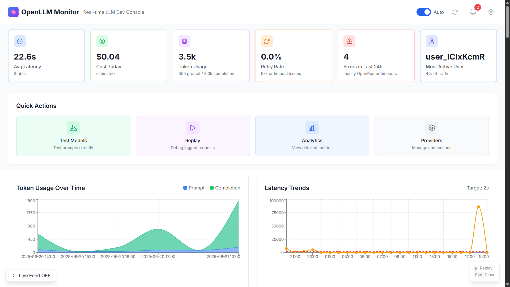

<div align="center">

# 🚀 OpenLLM Monitor

**The simplest way to monitor your LLM usage in real-time**

[](https://opensource.org/licenses/MIT)
[](https://nodejs.org/)
[](https://www.mongodb.com/)
[](https://reactjs.org/)
[](https://www.docker.com/)

_Monitor all your OpenAI, Ollama, and other LLM API calls without changing a single line of code. Get insights on costs, performance, and usage patterns through a beautiful dashboard._

**Created and Developed by [Prajeesh Chavan](https://prajeeshchavan.vercel.app)**  
_Full-Stack Developer & AI Enthusiast_  
📄 [View Full Credits & Project Journey](./CREDITS.md)

[🚀 Quick Start](#-quick-start) • [📊 Features](#-features) • [🔧 Installation](#-installation) • [📖 Documentation](#-documentation) • [🤝 Contributing](#-contributing)

</div>

---

## ⚡ Quick Start (2 minutes)

**Just want to see it working?** Run this:

```bash
git clone https://github.com/prajeesh-chavan/openllm-monitor.git
cd openllm-monitor
docker-compose up -d
```

Open http://localhost:3000 - That's it! 🎉

> **No LLM API keys?** No problem! Run `.\scripts\generate-seed-data.ps1` to see the dashboard with demo data.

## 🎯 What Does It Do?

OpenLLM Monitor sits between your app and LLM providers (OpenAI, Ollama, etc.) and automatically tracks:

- **💰 Costs** - How much you're spending on each model/provider
- **⚡ Performance** - Response times and error rates
- **📊 Usage** - Which models you use most, token consumption
- **🔄 Testing** - Compare the same prompt across different models

## 📸 See It In Action

| Dashboard                                       | Request Logs                          | Model Testing                              |
| ----------------------------------------------- | ------------------------------------- | ------------------------------------------ |
|  |  |  |
| Real-time monitoring                            | Detailed request logs                 | Compare models side-by-side                |

## 🛠️ Installation Options

<details>
<summary><b>🐳 Option 1: Docker (Recommended - Click to expand)</b></summary>

**Get everything running in one command:**

```bash
# Clone the repo
git clone https://github.com/prajeesh-chavan/openllm-monitor.git
cd openllm-monitor

# Start everything with Docker
docker-compose up -d
```

**What you get:**

- ✅ Frontend + Backend + MongoDB
- ✅ All dependencies included
- ✅ Ready to use immediately
- ✅ Access at http://localhost:3000

</details>

<details>
<summary><b>💻 Option 2: Manual Setup (For Development - Click to expand)</b></summary>

**Prerequisites:** Node.js 18+, MongoDB running locally

```bash
# 1. Clone and setup
git clone https://github.com/prajeesh-chavan/openllm-monitor.git
cd openllm-monitor

# 2. Backend setup
cd backend
npm install
cp ../.env.example .env
npm run dev

# 3. Frontend setup (new terminal)
cd ../frontend
npm install
npm run dev
```

**Access:** http://localhost:5173

</details>

<details>
<summary><b>⚙️ Configuration (Optional - Click to expand)</b></summary>

Create `backend/.env` with your API keys:

```env
# Required for MongoDB
MONGODB_URI=mongodb://localhost:27017/openllm-monitor

# Optional: Add your LLM API keys to enable monitoring
OPENAI_API_KEY=sk-your-key-here
OLLAMA_BASE_URL=http://localhost:11434

# Server settings
PORT=3001
```

**Note:** You can use the monitor without any API keys - just generate demo data to explore features!

</details>

## 🚀 How to Use

<details>
<summary><b>🔄 Method 1: Zero-Code Monitoring (Easiest - Click to expand)</b></summary>

Your existing code works unchanged! The monitor acts as a proxy:

```javascript
// Your existing OpenAI code - no changes needed!
const openai = new OpenAI({
  apiKey: process.env.OPENAI_API_KEY,
  baseURL: "http://localhost:3001/proxy/openai", // Only change: point to our proxy
});

const response = await openai.chat.completions.create({
  model: "gpt-3.5-turbo",
  messages: [{ role: "user", content: "Hello!" }],
});

// This request is now automatically tracked in your dashboard!
```

**How it works:** The proxy forwards your requests to OpenAI/Ollama and logs everything automatically.

</details>

<details>
<summary><b>📊 Method 2: Direct Integration (Click to expand)</b></summary>

Add monitoring to specific calls:

```javascript
const { LLMLogger } = require("openllm-monitor");

const logger = new LLMLogger({ apiUrl: "http://localhost:3001" });

const response = await logger.track(() =>
  openai.chat.completions.create({
    model: "gpt-4",
    messages: [{ role: "user", content: "Explain quantum computing" }],
  })
);
```

**When to use:** When you want more control over what gets tracked.

</details>

## 🎛️ Core Features

| Feature                 | Description                            | Why You Need It                       |
| ----------------------- | -------------------------------------- | ------------------------------------- |
| **Real-time Dashboard** | Live view of all LLM requests          | Spot issues as they happen            |
| **Cost Tracking**       | Automatic cost calculation per request | Control your AI spending              |
| **Multi-Provider**      | OpenAI, Ollama, OpenRouter, Mistral    | Compare providers easily              |
| **Prompt Replay**       | Re-run prompts across different models | Find the best model for your use case |
| **Export Data**         | CSV/JSON export of logs and analytics  | Integrate with your existing tools    |

## 📊 Supported Providers

| Provider       | Status         | Popular Models              |
| -------------- | -------------- | --------------------------- |
| **OpenAI**     | ✅ Ready       | GPT-3.5, GPT-4, GPT-4o      |
| **Ollama**     | ✅ Ready       | Llama2, Mistral, CodeLlama  |
| **OpenRouter** | ✅ Ready       | 100+ models via unified API |
| **Mistral AI** | ✅ Ready       | Mistral-7B, Mixtral         |
| **Anthropic**  | 🔜 Coming Soon | Claude 3, Claude 2          |

## 🧪 Try It Out

<details>
<summary><b>🎯 Want to explore without LLM APIs? Generate demo data! (Click to expand)</b></summary>

```bash
# Clone the repo first (if you haven't already)
git clone https://github.com/prajeesh-chavan/openllm-monitor.git
cd openllm-monitor

# Generate realistic demo data
cd scripts
.\generate-seed-data.ps1  # Windows
./generate-seed-data.sh   # Mac/Linux

# Now check your dashboard at http://localhost:3000
```

**What you get:**

- 🔢 1000+ realistic LLM requests
- 💰 Cost tracking data
- ⚡ Performance metrics
- 📊 Analytics ready to explore

Perfect for demos, testing, or just exploring all features!

</details>

## 🔍 Common Use Cases

**For Individual Developers:**

- Track your personal OpenAI/Claude usage and costs
- Compare different models for your projects
- Monitor performance of your AI features

**For Teams:** (Future feature)

- See who's using which models and how much
- Track costs across different projects/environments
- Debug issues with LLM integrations

**For Businesses:**

- Monitor production LLM usage
- Set up cost alerts and budgets
- Compare provider performance and costs

## 🆘 Need Help?

<details>
<summary><b>🔧 Quick Troubleshooting (Click to expand)</b></summary>

**Common issues and fixes:**

- **Port already in use?**

  - Change `PORT=3002` in `.env` file
  - Or: `docker-compose down` then `docker-compose up -d`

- **MongoDB not connecting?**

  - Run: `docker-compose restart mongodb`
  - Check: `docker-compose logs mongodb`

- **Ollama not working?**

  - Make sure it's running: `ollama serve`
  - Check URL in `.env`: `OLLAMA_BASE_URL=http://localhost:11434`

- **Frontend not loading?**
  - Clear browser cache
  - Check: `docker-compose logs frontend`

</details>

**Still need help?**

- 📖 [Full Documentation](./docs/)
- 💬 [GitHub Discussions](https://github.com/prajeesh-chavan/openllm-monitor/discussions)
- 🐛 [Report Issues](https://github.com/prajeesh-chavan/openllm-monitor/issues)

## 🤝 Contributing

Found a bug? Want a feature? We'd love your help!

1. Fork the repo
2. Create a feature branch: `git checkout -b my-cool-feature`
3. Make your changes
4. Submit a pull request

See [CONTRIBUTING.md](./CONTRIBUTING.md) for details.

## 📚 Advanced Documentation

<details>
<summary><b>📖 Detailed Guides & References (Click to expand)</b></summary>

Once you're up and running, explore these advanced topics:

- [🔧 Advanced Configuration](./docs/DEPLOYMENT.md) - Production deployment, environment variables
- [🏗️ Architecture Overview](./docs/DEVELOPMENT.md) - Technical architecture, contributing guide
- [📊 Analytics Features](./docs/ENHANCED_FEATURES.md) - Advanced dashboard features, alerts
- [🐳 Docker Guide](./docs/DOCKER_GUIDE.md) - Docker deployment options, troubleshooting
- [🧪 Model Testing](./docs/TEST_MODELS_GUIDE.md) - Advanced model comparison features
- [🚀 API Reference](./docs/API_DOCUMENTATION.md) - Complete API documentation
- [🛠️ Troubleshooting](./docs/TROUBLESHOOTING.md) - Detailed troubleshooting guide

</details>

## ⭐ Why Developers Love It

> "Finally, a simple way to see what my AI features are actually costing me!" - @developer1

> "The prompt comparison feature saved me hours of manual testing." - @ai-engineer

> "Zero setup hassle with Docker - was monitoring my production app in 5 minutes." - @startup-founder

## 📄 License

MIT License - see [LICENSE](LICENSE) for details.

## 👨‍💻 Built By

**[Prajeesh Chavan](https://prajeeshchavan.vercel.app)** - Full-Stack Developer & AI Enthusiast

If this project helped you, please ⭐ star it on GitHub!

[](https://github.com/prajeesh-chavan/openllm-monitor)

---

**Ready to start monitoring?** [Get Started](#-quick-start-2-minutes) • **Questions?** [Ask the Community](https://github.com/prajeesh-chavan/openllm-monitor/discussions)
