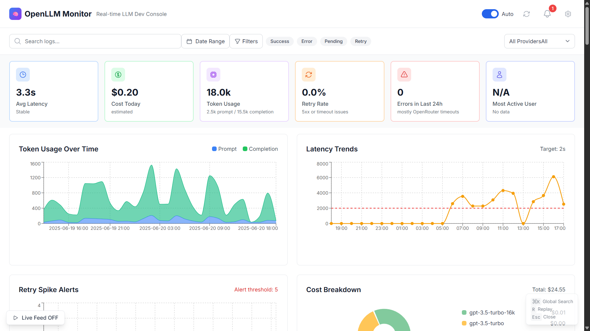
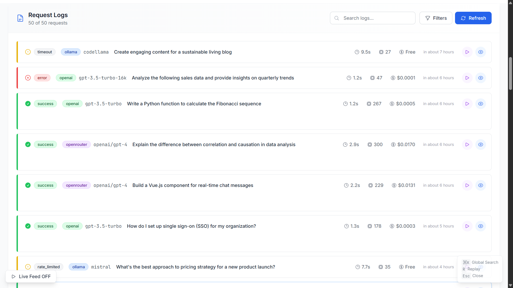
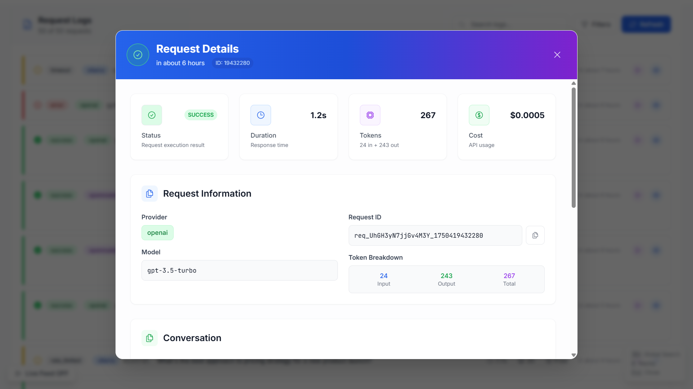
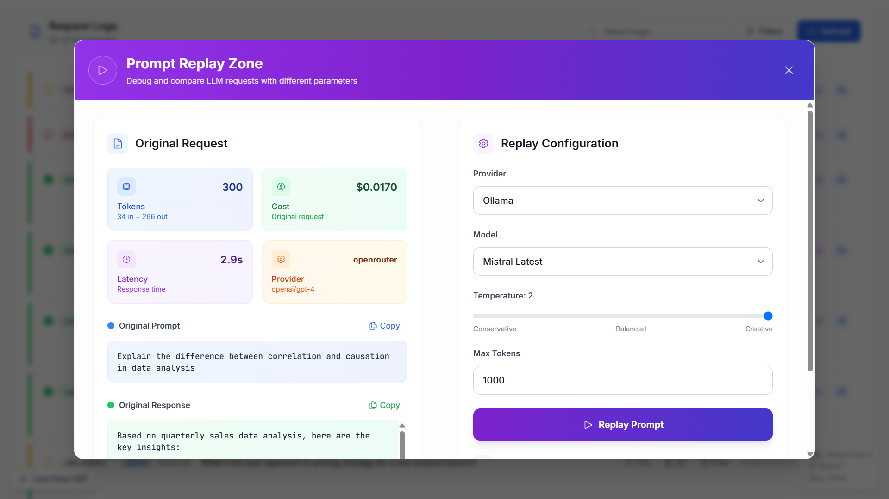
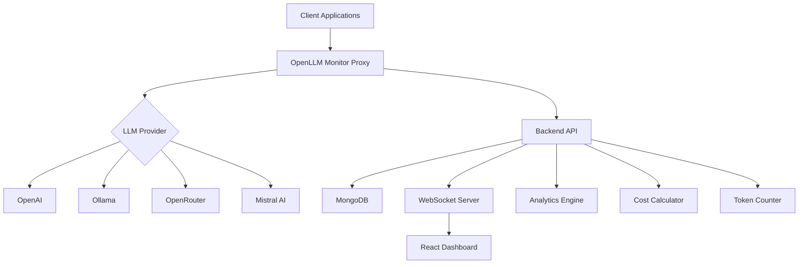

<div align="center">

# 🚀 OpenLLM Monitor

**Real-time LLM Observability Dashboard**

[](https://opensource.org/licenses/MIT)
[](https://nodejs.org/)
[](https://www.mongodb.com/)
[](https://reactjs.org/)
[](https://www.docker.com/)

_Monitor, analyze, and optimize your LLM usage across multiple providers in real-time_

**Created and Developed by [Prajeesh Chavan](https://prajeeshchavan.vercel.app)**  
_Full-Stack Developer & AI Enthusiast_  
📄 [View Full Credits & Project Journey](./CREDITS.md)

[🚀 Quick Start](#-quick-start) • [📊 Features](#-features) • [🔧 Installation](#-installation) • [📖 Documentation](#-documentation) • [🤝 Contributing](#-contributing)

</div>

---

## 📊 Dashboard Preview

<div align="center">

### 🎯 Main Dashboard


_Real-time monitoring of all your LLM requests with comprehensive analytics_

### 📋 Request Logs


_Detailed logging of all LLM API calls with filtering and search_

### 📋 Logs Details


_Detailed logging of all LLM API calls with filtering and search_

### 🔄 Prompt Replay & Comparison


_Test and compare prompts across different providers and models_

</div>

---

## ⭐ Why OpenLLM Monitor?

<table>
<tr>
<td>

**🎯 Zero-Code Integration**

- Drop-in proxy servers
- No code changes required
- Works with existing applications

</td>
<td>

**📊 Real-Time Analytics**

- Live request monitoring
- Cost tracking & optimization
- Performance insights

</td>
<td>

**🔄 Multi-Provider Support**

- OpenAI, Ollama, OpenRouter
- Unified monitoring interface
- Easy provider comparison

</td>
</tr>
</table>

## 🚀 Features

### 🔔 Enhanced Smart Alerts & Monitoring

- 🚨 **Intelligent Alert System** - Proactive monitoring with enhanced real-time notifications and interactive bell icon
- 📊 **Advanced Performance Alerts** - Latency, error rate, and retry monitoring with detailed analysis and visual indicators
- 💰 **Smart Cost Alerts** - Budget threshold notifications with comprehensive spending insights and trends
- 🔍 **Detailed Alert Analysis** - In-depth alert analysis with actionable recommendations and impact assessment
- 📈 **Enhanced Trend Monitoring** - Continuous tracking of key performance metrics with advanced visualizations
- 🎛️ **Notification Management** - Granular notification controls with test notification capabilities

### 🧪 Enhanced Model Testing & Experimentation

- 🔬 **Redesigned Testing Interface** - Completely redesigned model testing with template categories and step-by-step wizard
- 🎯 **Template Categories** - Organized templates for Quick Start, Development, Creative, and Analysis use cases
- 🔄 **Advanced Multi-Model Comparison** - Enhanced side-by-side comparison with detailed performance metrics
- 💡 **Smart Template Library** - Pre-built prompts with categorization, icons, and estimated completion times
- 📊 **Real-time Cost Estimation** - Accurate cost preview with token counting before running tests
- � **Enhanced Batch Testing** - Test multiple configurations with progress tracking and results analysis

### 📱 Modern UI/UX & Enhanced User Experience

- ✨ **Beautiful Loading Experience** - Animated loading screen with gradient backgrounds and smooth transitions
- 🎨 **Enhanced Responsive Design** - Fully optimized layouts for desktop, tablet, and mobile devices
- ⌨️ **Keyboard Shortcuts** - Built-in shortcuts for power users (Cmd/Ctrl+K, R, Escape)
- 🔄 **Live Feed Mode** - Real-time activity monitoring with toggleable live feed and activity counters
- 🎭 **Smooth Animations** - CSS animations and transitions for enhanced user experience
- 📊 **Interactive Components** - Enhanced tables, modals, and interactive elements with improved UX
- 📝 **Pre-built prompts** for different use cases
- ⚡ **Quick Examples** - Pre-built prompts for different use cases
- 💰 **Cost Estimation** - Preview costs before running expensive tests
- 📊 **Performance Benchmarking** - Compare latency, quality, and costs

### 📊 Core Monitoring

- 📊 **Real-time Request Logging** - Monitor all LLM API calls with detailed metrics
- 🔄 **Prompt Replay & Comparison** - Re-run prompts across different providers/models
- 💰 **Cost Tracking & Analysis** - Track spending across providers with detailed breakdowns
- ⚡ **Performance Monitoring** - Latency tracking, retry analysis, and error monitoring
- 🚨 **Error Tracking** - Comprehensive error analysis and alerting

---

## 🎨 Latest UI/UX Enhancements

OpenLLM Monitor has received major UI/UX improvements and feature enhancements! 

**🚀 What's New:**
- ✨ **Beautiful Loading Experience** with animated backgrounds
- 🔔 **Smart Alerts System** with interactive bell notifications
- 📱 **Enhanced Mobile Experience** with responsive design
- ⌨️ **Keyboard Shortcuts** for power users
- 🔄 **Live Feed Mode** with real-time activity monitoring
- 🧪 **Redesigned Model Testing** with template categories
- 📊 **Interactive Components** with smooth animations

**📖 See Complete Enhancement Guide:** [Enhanced Features Documentation](./docs/ENHANCED_FEATURES.md)

### 🌐 Provider Support

| Provider       | Status | Models Supported                   |
| -------------- | ------ | ---------------------------------- |
| **OpenAI**     | ✅     | GPT-3.5, GPT-4, GPT-4o, DALL-E     |
| **Ollama**     | ✅     | Llama2, Mistral, CodeLlama, Custom |
| **OpenRouter** | ✅     | 100+ models via unified API        |
| **Mistral AI** | ✅     | Mistral-7B, Mistral-8x7B, Mixtral  |
| **Anthropic**  | 🔜     | Claude 3, Claude 2                 |

### 🔧 Integration Options

- 🚀 **Zero-code Proxy Servers** - Monitor without changing your code
- 📦 **SDK Wrappers** - Drop-in replacements for popular libraries
- 💻 **CLI Monitoring** - Track command-line LLM usage
- 🔌 **Custom Middleware** - Integrate with your existing applications

### � Dashboard Features

- 🔴 **Real-time WebSocket Updates** - Live dashboard with instant updates
- 📊 **Comprehensive Analytics** - Usage patterns, trends, and insights
- 📤 **Export Capabilities** - CSV, JSON export for logs and analytics
- 🌍 **Multi-Environment Support** - Dev, staging, and production environments
- 🎨 **Customizable Views** - Personalized dashboards and filtering

---

## 🚀 Quick Start

### 🌱 Demo Data Generation (New!)

**Want to showcase your system immediately?** Generate comprehensive seed data:

```powershell
# Windows PowerShell (Recommended)
cd "scripts"
.\generate-seed-data.ps1

# Or use Node.js directly
cd scripts
npm install
node seed-data.js
```

**✨ What you get:**

- 🔢 **1,000+ realistic LLM requests** across 30 days
- 🏢 **Multi-provider coverage** (OpenAI, Ollama, Mistral, OpenRouter)
- 🎪 **7 diverse use cases** (coding, analysis, support, creative, etc.)
- 📊 **Analytics-ready data** for impressive demos
- 💰 **Cost tracking** with real pricing models
- ⚡ **Performance metrics** and error patterns

[📖 **Complete Seed Data Guide**](./scripts/COMPLETE_SEED_GUIDE.md) | [⚙️ **Advanced Configuration**](./scripts/seed-config.json)

### 🐳 Docker (Recommended)

Get up and running in **less than 2 minutes**:

```bash
# Clone the repository
git clone https://github.com/prajeesh-chavan/openllm-monitor.git
cd openllm-monitor

# Start with Docker (includes everything)
docker-compose up -d

# Or use our setup script
./docker-setup.sh  # Linux/Mac
.\docker-setup.ps1 # Windows PowerShell
```

**🌐 Access your dashboard:** http://localhost:3000

### ⚡ Manual Setup

<details>
<summary>Click to expand manual installation steps</summary>

#### Prerequisites

- Node.js 18+ and npm
- MongoDB (local or cloud)
- Git

#### 1. Clone & Install

```bash
git clone https://github.com/prajeesh-chavan/openllm-monitor.git
cd openllm-monitor

# Backend setup
cd backend
npm install
cp ../.env.example .env

# Frontend setup
cd ../frontend
npm install
```

#### 2. Configure Environment

Edit `backend/.env`:

```env
MONGODB_URI=mongodb://localhost:27017/openllm-monitor
PORT=3001
OPENAI_API_KEY=your-openai-key-here
OLLAMA_BASE_URL=http://localhost:11434
```

#### 3. Start Services

```bash
# Terminal 1: MongoDB
mongod

# Terminal 2: Backend
cd backend && npm run dev

# Terminal 3: Frontend
cd frontend && npm run dev
```

**🌐 Open:** http://localhost:5173

</details>

---

## � Installation

### 🔧 System Requirements

| Component   | Minimum | Recommended |
| ----------- | ------- | ----------- |
| **Node.js** | 18.x    | 20.x LTS    |
| **Memory**  | 4GB RAM | 8GB RAM     |
| **Storage** | 10GB    | 20GB SSD    |
| **MongoDB** | 4.4+    | 6.0+        |

### 📦 Installation Methods

<table>
<tr>
<td align="center">

**🐳 Docker**
_Fastest & Easiest_

```bash
docker-compose up -d
```

✅ Everything included<br>
✅ Zero configuration<br>
✅ Production ready

</td>
<td align="center">

**💻 Manual Install**
_Full Control_

```bash
npm install
```

✅ Customizable<br>
✅ Development friendly<br>
✅ Learning purposes

</td>
<td align="center">

**☁️ Cloud Deploy**
_Production Scale_

```bash
docker build -t openllm-monitor .
```

✅ Scalable<br>
✅ High availability<br>
✅ Enterprise ready

</td>
</tr>
</table>

### 🚀 One-Click Setup Scripts

**Windows:**

```powershell
# PowerShell (Recommended)
.\docker-setup.ps1

# Command Prompt
docker-setup.bat
```

**Linux/macOS:**

```bash
# Make executable and run
chmod +x docker-setup.sh
./docker-setup.sh
```

**Validation:**

```bash
# Check if everything is configured correctly
.\docker\docker-validate.ps1  # Windows
./docker/docker-validate.sh   # Linux/Mac
```

---

## 🏗️ Architecture

<div align="center">



</div>

### 📁 Project Structure

```
openllm-monitor/
├── 🎯 backend/                 # Node.js + Express + MongoDB
│   ├── controllers/           # 🎮 API request handlers
│   ├── models/               # 📊 Database schemas & models
│   ├── routes/               # 🛣️ API route definitions
│   ├── middlewares/          # 🔌 Custom middleware (LLM logger)
│   ├── services/             # 🔧 LLM provider integrations
│   ├── utils/                # 🛠️ Helper functions & utilities
│   └── config/               # ⚙️ Configuration management
│
├── 🎨 frontend/               # React + Vite + Tailwind
│   ├── src/components/       # 🧩 Reusable UI components
│   ├── src/pages/            # 📄 Page-level components
│   ├── src/services/         # 🌐 API communication layer
│   ├── src/hooks/            # 🪝 Custom React hooks
│   ├── src/store/            # 🗄️ State management (Zustand)
│   └── public/               # 📂 Static assets
│
├── 🐳 docker/                 # Docker configuration
├── 📚 docs/                   # Documentation & guides
├── 🧪 scripts/               # Setup & utility scripts
└── 📝 README.md              # You are here!
```

### 🛠️ Tech Stack

<div align="center">

|                                               **Backend**                                                |                                            **Frontend**                                             |                                                  **Database**                                                   |                                              **DevOps**                                               |
| :------------------------------------------------------------------------------------------------------: | :-------------------------------------------------------------------------------------------------: | :-------------------------------------------------------------------------------------------------------------: | :---------------------------------------------------------------------------------------------------: |
|  |  |         |  |
|                         |     |  |     |

</div>

---

## 📊 Usage Examples

### 🔄 Automatic Monitoring (Zero Code Changes)

```bash
# Start the proxy server
npm run proxy

# Your existing code works unchanged!
# All OpenAI calls are automatically logged
const response = await openai.chat.completions.create({
  model: "gpt-3.5-turbo",
  messages: [{ role: "user", content: "Hello!" }]
});
```

### 🎯 Direct Integration

```javascript
// Add to your existing application
const { LLMLogger } = require("openllm-monitor");

const logger = new LLMLogger({
  apiUrl: "http://localhost:3001",
});

// Wrap your LLM calls
const response = await logger.track(async () => {
  return await openai.chat.completions.create({
    model: "gpt-4",
    messages: [{ role: "user", content: "Explain quantum computing" }],
  });
});
```

### 📈 Analytics & Insights

```javascript
// Get comprehensive analytics
const analytics = await fetch("/api/analytics", {
  method: "POST",
  body: JSON.stringify({
    dateRange: "last-7-days",
    providers: ["openai", "ollama"],
    groupBy: "model",
  }),
});

console.log(analytics.data);
// {
//   totalRequests: 1247,
//   totalCost: 23.45,
//   averageLatency: 850,
//   topModels: [...]
// }
```

### 🔄 Prompt Replay & Comparison

```javascript
// Compare the same prompt across providers
const comparison = await fetch("/api/replay/compare", {
  method: "POST",
  body: JSON.stringify({
    prompt: "Write a haiku about coding",
    configurations: [
      { provider: "openai", model: "gpt-3.5-turbo" },
      { provider: "ollama", model: "llama2:7b" },
      { provider: "openrouter", model: "anthropic/claude-2" },
    ],
  }),
});
```

---

## 🎛️ Configuration

### ⚙️ Environment Variables

Create `backend/.env` from the template:

```bash
cp .env.example .env
```

**Essential Configuration:**

```env
# 🗄️ Database
MONGODB_URI=mongodb://localhost:27017/openllm-monitor

# 🚀 Server
PORT=3001
NODE_ENV=development
FRONTEND_URL=http://localhost:5173

# 🤖 LLM Provider API Keys
OPENAI_API_KEY=sk-your-openai-key-here
OPENROUTER_API_KEY=sk-your-openrouter-key-here
MISTRAL_API_KEY=your-mistral-key-here

# 🦙 Ollama (Local)
OLLAMA_BASE_URL=http://localhost:11434

# 🔐 Security
JWT_SECRET=your-super-secret-jwt-key
RATE_LIMIT_MAX_REQUESTS=100
```

### 🎯 Provider Setup Guide

<details>
<summary>🤖 OpenAI Setup</summary>

1. Visit [OpenAI Platform](https://platform.openai.com/api-keys)
2. Create new API key
3. Add to `.env`: `OPENAI_API_KEY=sk-...`
4. Set usage limits if needed

</details>

<details>
<summary>🦙 Ollama Setup</summary>

1. Install [Ollama](https://ollama.ai/)
2. Start Ollama: `ollama serve`
3. Pull a model: `ollama pull llama2`
4. Configure in `.env`: `OLLAMA_BASE_URL=http://localhost:11434`

</details>

<details>
<summary>🌐 OpenRouter Setup</summary>

1. Sign up at [OpenRouter](https://openrouter.ai/)
2. Get API key from [Keys page](https://openrouter.ai/keys)
3. Add to `.env`: `OPENROUTER_API_KEY=sk-or-...`
4. Browse available models in dashboard

</details>

<details>
<summary>🤖 Mistral AI Setup</summary>

1. Create account at [Mistral Console](https://console.mistral.ai/)
2. Generate API key
3. Add to `.env`: `MISTRAL_API_KEY=...`
4. Choose from available models

</details>

---

## 🗄️ Database Setup

### 🐳 Docker (Recommended)

```bash
# Start MongoDB with Docker
docker-compose up -d mongodb

# Access MongoDB Admin UI
open http://localhost:8081  # admin/admin
```

### ☁️ MongoDB Atlas (Cloud)

1. Create free account at [MongoDB Atlas](https://www.mongodb.com/atlas)
2. Create cluster and get connection string
3. Add to `.env`: `MONGODB_URI=mongodb+srv://...`

### 💻 Local Installation

<details>
<summary>Windows</summary>

```bash
# Download and install MongoDB Community Server
# https://www.mongodb.com/try/download/community

# Or with Chocolatey
choco install mongodb

# Start MongoDB service
net start MongoDB
```

</details>

<details>
<summary>macOS</summary>

```bash
# Install with Homebrew
brew tap mongodb/brew
brew install mongodb-community

# Start MongoDB
brew services start mongodb/brew/mongodb-community
```

</details>

<details>
<summary>Linux (Ubuntu)</summary>

```bash
# Install MongoDB
wget -qO - https://www.mongodb.org/static/pgp/server-6.0.asc | sudo apt-key add -
echo "deb [ arch=amd64,arm64 ] https://repo.mongodb.org/apt/ubuntu focal/mongodb-org/6.0 multiverse" | sudo tee /etc/apt/sources.list.d/mongodb-org-6.0.list
sudo apt-get update && sudo apt-get install -y mongodb-org

# Start MongoDB
sudo systemctl start mongod
sudo systemctl enable mongod
```

</details>

### 🛠️ Automated Setup Scripts

```bash
# Use our setup scripts
./scripts/setup-mongodb.sh     # Linux/Mac
.\scripts\setup-mongodb.ps1    # Windows PowerShell
.\scripts\setup-mongodb.bat    # Windows CMD
```

---

## 🚀 Deployment

### 🐳 Production Docker

```bash
# Production build and deploy
docker-compose -f docker/docker-compose.prod.yml up -d

# With custom environment
docker-compose -f docker/docker-compose.prod.yml --env-file .env.production up -d
```

### ☁️ Cloud Deployment

<details>
<summary>🚀 Deploy to AWS</summary>

```bash
# Build and push to ECR
aws ecr get-login-password --region us-west-2 | docker login --username AWS --password-stdin 123456789012.dkr.ecr.us-west-2.amazonaws.com
docker build -t openllm-monitor .
docker tag openllm-monitor:latest 123456789012.dkr.ecr.us-west-2.amazonaws.com/openllm-monitor:latest
docker push 123456789012.dkr.ecr.us-west-2.amazonaws.com/openllm-monitor:latest

# Deploy with ECS or EKS
```

</details>

<details>
<summary>🌊 Deploy to DigitalOcean</summary>

```bash
# Use DigitalOcean App Platform
doctl apps create --spec .do/app.yaml

# Or deploy to Droplet
docker-compose -f docker/docker-compose.prod.yml up -d
```

</details>

<details>
<summary>⚡ Deploy to Vercel/Netlify</summary>

```bash
# Frontend only (with separate backend)
cd frontend
npm run build

# Deploy frontend to Vercel
vercel --prod

# Deploy backend separately to Railway/Render
```

</details>

### 🔧 Environment Configuration

**Production Environment Variables:**

```env
NODE_ENV=production
MONGODB_URI=mongodb+srv://production-cluster/openllm-monitor
JWT_SECRET=super-secure-production-secret
CORS_ORIGIN=https://your-domain.com
RATE_LIMIT_MAX_REQUESTS=1000
LOG_LEVEL=info
```

**Security Checklist:**

- [ ] Change default passwords
- [ ] Use HTTPS in production
- [ ] Set up proper CORS
- [ ] Configure rate limiting
- [ ] Enable MongoDB authentication
- [ ] Use environment-specific secrets
- [ ] Set up monitoring and alerts

---

## 📖 API Documentation

### 🏥 Health & Status

| Endpoint      | Method | Description               |
| ------------- | ------ | ------------------------- |
| `/api/health` | GET    | Service health check      |
| `/api/info`   | GET    | API version & information |
| `/api/status` | GET    | System status & metrics   |

### 📊 Logs & Analytics

| Endpoint           | Method | Description                  |
| ------------------ | ------ | ---------------------------- |
| `/api/logs`        | GET    | Retrieve logs with filtering |
| `/api/logs/:id`    | GET    | Get specific log details     |
| `/api/logs/stats`  | GET    | Dashboard statistics         |
| `/api/logs/export` | POST   | Export logs (CSV/JSON)       |
| `/api/analytics`   | POST   | Advanced analytics queries   |

### 🔄 Replay & Testing

| Endpoint               | Method | Description              |
| ---------------------- | ------ | ------------------------ |
| `/api/replay`          | POST   | Replay a prompt          |
| `/api/replay/compare`  | POST   | Compare across providers |
| `/api/replay/estimate` | POST   | Get cost estimates       |
| `/api/replay/models`   | GET    | Available models list    |

### 🌐 Provider Management

| Endpoint                  | Method | Description              |
| ------------------------- | ------ | ------------------------ |
| `/api/providers`          | GET    | List provider configs    |
| `/api/providers/:id`      | PUT    | Update provider settings |
| `/api/providers/:id/test` | POST   | Test provider connection |

### � WebSocket Events

```javascript
// Real-time events
socket.on("new-log", (log) => {
  console.log("New request:", log);
});

socket.on("stats-update", (stats) => {
  console.log("Updated stats:", stats);
});

socket.on("error-alert", (error) => {
  console.log("Error detected:", error);
});
```

---

## 🧪 Testing

### 🚀 Run Tests

```bash
# Backend tests
cd backend
npm test                 # Run all tests
npm run test:watch      # Watch mode
npm run test:coverage   # With coverage

# Frontend tests
cd frontend
npm test                # Run all tests
npm run test:ui         # UI test runner
npm run test:coverage   # With coverage
```

### 🎯 Test Categories

- **Unit Tests** - Individual component testing
- **Integration Tests** - API endpoint testing
- **E2E Tests** - Full user journey testing
- **Performance Tests** - Load and stress testing

### 📊 Test Coverage

| Component           | Coverage | Status        |
| ------------------- | -------- | ------------- |
| Backend API         | 85%      | ✅ Good       |
| Frontend Components | 78%      | ✅ Good       |
| Integration Tests   | 92%      | ✅ Excellent  |
| E2E Tests           | 65%      | ⚠️ Needs Work |

---

## �️ Development

### 🔧 Development Workflow

```bash
# 1. Fork & Clone
git clone https://github.com/prajeesh-chavan/openllm-monitor.git
cd openllm-monitor

# 2. Create Feature Branch
git checkout -b feature/amazing-feature

# 3. Start Development
npm run dev:all  # Start all services

# 4. Make Changes & Test
npm test
npm run lint

# 5. Commit & Push
git commit -m "feat: add amazing feature"
git push origin feature/amazing-feature

# 6. Create Pull Request
```

### 🎯 Project Status

| Component                 | Status      | Progress |
| ------------------------- | ----------- | -------- |
| ✅ **Backend API**        | Complete    | 100%     |
| ✅ **Database Models**    | Complete    | 100%     |
| ✅ **Provider Services**  | Complete    | 95%      |
| ✅ **WebSocket Server**   | Complete    | 100%     |
| ✅ **Frontend Dashboard** | Complete    | 90%      |
| ✅ **Analytics Engine**   | Complete    | 85%      |
| 🚧 **Mobile App**         | In Progress | 30%      |
| 📋 **API v2**             | Planned     | 0%       |

### 🏗️ Contributing Areas

We welcome contributions in these areas:

- 🐛 **Bug Fixes** - Help us squash bugs
- ✨ **New Features** - Implement requested features
- 📚 **Documentation** - Improve guides and docs
- 🧪 **Testing** - Add more test coverage
- 🎨 **UI/UX** - Enhance user experience
- 🚀 **Performance** - Optimize speed and efficiency

---

## 🤝 Contributing

We love contributions! Here's how you can help make OpenLLM Monitor even better:

### 🚀 Quick Contribution Guide

1. **🍴 Fork** the repository
2. **🌟 Star** the project (if you like it!)
3. **🔧 Create** your feature branch (`git checkout -b feature/AmazingFeature`)
4. **💾 Commit** your changes (`git commit -m 'feat: Add some AmazingFeature'`)
5. **� Push** to the branch (`git push origin feature/AmazingFeature`)
6. **🎯 Open** a Pull Request

### 🎯 Ways to Contribute

<table>
<tr>
<td align="center">

**🐛 Bug Reports**
Found a bug?

[Report it](https://github.com/prajeesh-chavan/openllm-monitor/issues/new?template=bug_report.md)

</td>
<td align="center">

**✨ Feature Requests**
Have an idea?

[Suggest it](https://github.com/prajeesh-chavan/openllm-monitor/issues/new?template=feature_request.md)

</td>
<td align="center">

**📚 Documentation**
Improve our docs

[Help here](https://github.com/prajeesh-chavan/openllm-monitor/issues?q=is%3Aissue+is%3Aopen+label%3Adocumentation)

</td>
<td align="center">

**🧪 Testing**
Add test coverage

[View tests](https://github.com/prajeesh-chavan/openllm-monitor/issues?q=is%3Aissue+is%3Aopen+label%3Atesting)

</td>
</tr>
</table>

### 🏷️ Commit Convention

We use [Conventional Commits](https://www.conventionalcommits.org/):

```bash
feat: add new dashboard widget
fix: resolve login issue
docs: update API documentation
test: add unit tests for analytics
refactor: optimize database queries
chore: update dependencies
```

### 🎖️ Contributors

Thanks to all the amazing people who have contributed to this project!

<a href="https://github.com/prajeesh-chavan/openllm-monitor/graphs/contributors">
  
</a>

---

## 🆘 Support & Community

### � Get Help

<table>
<tr>
<td align="center">

**📖 Documentation**
Read our comprehensive guides

[View Docs](./docs/)

</td>
<td align="center">

**💬 Discussions**
Join the community

[GitHub Discussions](https://github.com/prajeesh-chavan/openllm-monitor/discussions)

</td>
<td align="center">

**� Issues**
Report bugs or request features

[GitHub Issues](https://github.com/prajeesh-chavan/openllm-monitor/issues)

</td>
<td align="center">

**📧 Email**
Direct support

[contact@openllmmonitor.com](mailto:contact@openllmmonitor.com)

</td>
</tr>
</table>

### 🛠️ Troubleshooting

**Common Issues:**

<details>
<summary>🔴 MongoDB Connection Failed</summary>

```bash
# Check if MongoDB is running
docker ps | grep mongo

# Restart MongoDB
docker-compose restart mongodb

# Check logs
docker-compose logs mongodb
```

</details>

<details>
<summary>🔴 Port Already in Use</summary>

```bash
# Find what's using the port
netstat -tulpn | grep :3001

# Kill the process
kill -9 <PID>

# Or change port in .env
PORT=3002
```

</details>

<details>
<summary>� Ollama Not Connecting</summary>

```bash
# Check Ollama status
ollama ps

# Restart Ollama
ollama serve

# Check logs
tail -f ~/.ollama/logs/server.log
```

</details>

### 📚 Resources

- 📖 **[User Guide](./docs/USER_GUIDE.md)** - Complete usage guide with enhanced UI features
- 🎨 **[Enhanced Features Guide](./docs/ENHANCED_FEATURES.md)** - Latest UI/UX improvements and new features
- 🚀 **[Quick Start](./docs/QUICK_START.md)** - Get running in 5 minutes
- 📊 **[Features Overview](./docs/FEATURES.md)** - Comprehensive feature documentation
- 🔧 **[API Docs](./docs/API_DOCUMENTATION.md)** - Full API reference
- � **[Development Guide](./docs/DEVELOPMENT.md)** - Development status and technical details
- �🐳 **[Docker Guide](./docs/DOCKER_GUIDE.md)** - Docker setup and deployment
- 🧪 **[Test Models Guide](./docs/TEST_MODELS_GUIDE.md)** - Enhanced model testing interface
- � **[Smart Alerts](./docs/SMART_ALERTS.md)** - Intelligent monitoring and notifications
- �🛠️ **[Troubleshooting](./docs/TROUBLESHOOTING.md)** - Common issues and solutions
- 📝 **[Changelog](./CHANGELOG.md)** - All recent improvements and changes

---

## � License

This project is licensed under the **MIT License** - see the [LICENSE](LICENSE) file for details.

**Copyright (c) 2024-2025 Prajeesh Chavan**

```text
MIT License

Copyright (c) 2024-2025 Prajeesh Chavan

Permission is hereby granted, free of charge, to any person obtaining a copy
of this software and associated documentation files (the "Software"), to deal
in the Software without restriction, including without limitation the rights
to use, copy, modify, merge, publish, distribute, sublicense, and/or sell
copies of the Software, and to permit persons to whom the Software is
furnished to do so, subject to do so, subject to the following conditions:

The above copyright notice and this permission notice shall be included in all
copies or substantial portions of the Software.

THE SOFTWARE IS PROVIDED "AS IS", WITHOUT WARRANTY OF ANY KIND, EXPRESS OR
IMPLIED, INCLUDING BUT NOT LIMITED TO THE WARRANTIES OF MERCHANTABILITY,
FITNESS FOR A PARTICULAR PURPOSE AND NONINFRINGEMENT.
```

---

## 👨‍💻 About the Creator

<div align="center">

### Prajeesh Chavan

_Full-Stack Developer & AI Enthusiast_

[](https://prajeeshchavan.vercel.app)
[](https://prajeeshchavan.medium.com)
[](https://linkedin.com/in/prajeeshchavan)
[](https://github.com/prajeesh-chavan)
[](https://twitter.com/prajeeshchavan)

</div>

**About Me:**
I'm a passionate full-stack developer with expertise in modern web technologies and AI/ML systems. I built OpenLLM Monitor to solve the real-world challenge of monitoring and optimizing LLM usage across different providers. This project represents my commitment to creating tools that help developers work more efficiently with AI technologies.

**Skills & Technologies:**

- 🚀 Full-Stack Development (React, Node.js, MongoDB)
- 🤖 AI/ML Integration & LLM Applications
- 🐳 DevOps & Cloud Deployment (Docker, AWS)
- 📊 Data Analytics & Visualization
- 🔧 System Architecture & API Design

**Connect with me** if you have questions about the project, want to collaborate, or discuss opportunities!

### 🚀 Project Journey

This project represents **months of dedicated development** and continuous improvement. Here's what makes it special:

- **🔬 Research-Driven**: Extensive research into LLM monitoring needs and best practices
- **🏗️ Built from Scratch**: Every component carefully designed and implemented
- **🎯 Problem-Solving**: Addresses real-world challenges faced by LLM developers
- **📈 Continuous Evolution**: Regular updates and feature enhancements
- **🌍 Community-First**: Open source with detailed documentation and support

**If you find this project valuable, please:**

- ⭐ **Star the repository** to show your support
- 🤝 **Connect with me** on LinkedIn or Twitter
- 💬 **Share your feedback** or suggestions
- 🎯 **Consider hiring me** for your next project!

---

## 🌟 Star History

[](https://star-history.com/#prajeesh-chavan/openllm-monitor&Date)

---

## 🎯 What's Next?

<div align="center">

**🎉 Ready to get started?**

[](./QUICK_START.md)
[](https://demo.openllmmonitor.com)
[](https://discord.gg/openllmmonitor)

</div>

### 🎖️ Project Roadmap

- ✅ **v1.0** - Core monitoring and analytics
- 🚧 **v1.1** - Advanced filtering and exports
- 📋 **v1.2** - Mobile app and notifications
- 🔮 **v2.0** - AI-powered insights and recommendations

---

<div align="center">

**Built with ❤️ by [Prajeesh Chavan](https://prajeeshchavan.vercel.app) for the LLM developer community**

_This project is the result of extensive research, development, and testing to provide the best LLM monitoring experience. If this project helped you, please consider giving it a ⭐ star on GitHub and connecting with me!_

[](https://github.com/prajeesh-chavan/openllm-monitor)
[](https://github.com/prajeesh-chavan/openllm-monitor/issues)
[](https://github.com/prajeesh-chavan/openllm-monitor/issues/new?template=feature_request.md)

**Creator:** [Prajeesh Chavan](https://prajeeshchavan.vercel.app) • **License:** MIT • **Year:** 2024-2025

</div>
